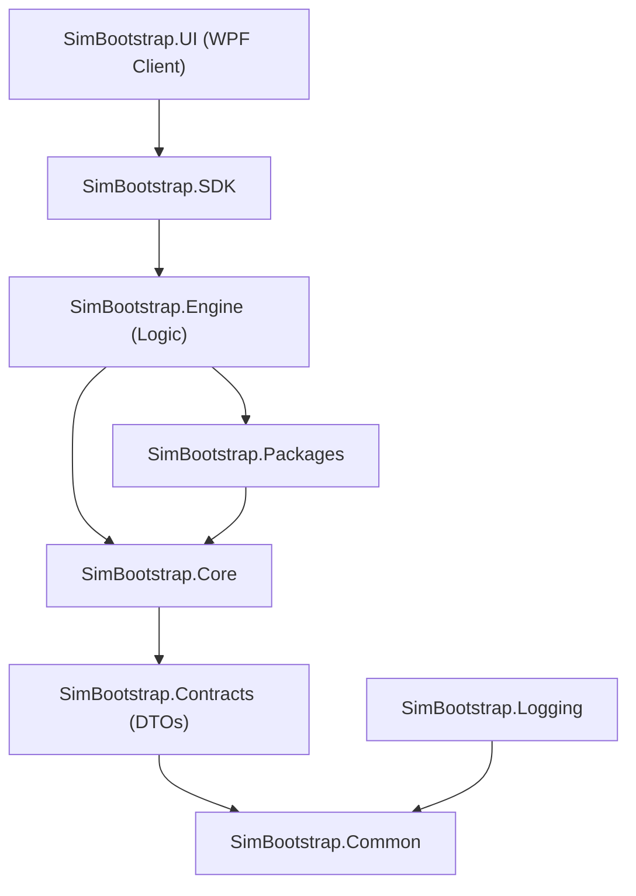

# Architecture Specification — SimBootstrap

This document outlines the layered architecture of the SimBootstrap platform.

## Layer Dependency Flow

No circular dependencies are allowed. Platform-specific assemblies are decoupled and isolated.

## Layer Descriptions

1. **SimBootstrap.UI**: The WPF desktop application (MVVM-based) executing on simulator target PCs to guide local admins. Excluded from compilation on non-Windows platforms.
2. **SimBootstrap.SDK**: Service registration helpers, configuration bindings, and host integrations.
3. **SimBootstrap.Engine**: Handlers, registry states, verifiers, down-loaders, and dependency resolver tasks.
4. **SimBootstrap.Core**: Base engine abstractions and orchestration frameworks.
5. **SimBootstrap.Packages**: Local manifest parsing and packages indexing utilities.
6. **SimBootstrap.Contracts**: Strongly typed records (e.g. `PackageManifest`, `VerifyRule`).
7. **SimBootstrap.Common**: Shared primitives, helper classes, and generic extensions.
8. **SimBootstrap.Logging**: Structured Serilog wrapping.
