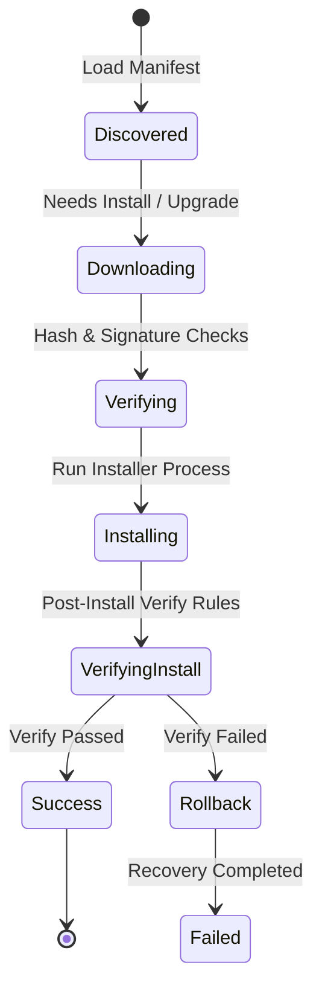

# Package Manifest Specification

This document details the manifest schema and package life cycle.

## Package Lifecycle Flow

## Manifest Fields

* **id**: Unique string identifying the package.
* **name**: Human-readable display label.
* **version**: Version string.
* **installerType**: Installer engine style (`msi`, `exe`, `zip`, `powershell`).
* **downloadUrl**: HTTP url payload destination.
* **installArguments**: Command-line switches for silent installation.
* **verifyRules**: Pre/Post-installation verification tests (Registry keys, file path patterns, service states).
* **dependencies**: Array of package IDs required before executing this installer.
